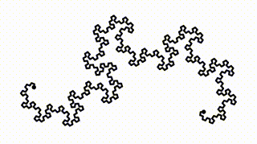

# [g9.js](http://omrelli.ug/g9)

g9 is a javascript library for creating **automatically interactive graphics**.

Give g9 some intial data and a function that takes data and creates a drawing, and it will automatically change your data when you interact with the drawing.


For example, the following code:
```javascript
g9({
	x: 0,
	y: 0
}, function(data, ctx){
	
	ctx.circle(data.x, data.y)
	ctx.circle(data.y, data.x)
	
})
.insertInto('#container')
```

produces the following interactive graphic: 


This gets more exciting when you do stuff like fractals:



You can see (and play with!) more examples [on the website](http://omrelli.ug/g9), or [head to the docs](#docs) for a full treatment of the API.


# Installation
You can use g9 with npm or with a script tag:


## npm

```
npm install g9
```

```javascript
var g9 = require('g9')
// or 
import g9 from 'g9'
```


## `<script/>`

First download a copy of g9 [here](https://raw.githubusercontent.com/bijection/g9/master/dist/g9.js), then

```html
<script src='path/to/g9.js'></script>
 
<script>
	// g9 is now defined 
</script>
```


# Docs

* [g9(initialData, data2graphics[, onChange])](#g9initialdata-data2graphics-onchange)
  + [initialData](#initialdata)
  + [data2graphics(data, ctx)](#data2graphicsdata-ctx)
    - [ctx](#ctx)
    - [ctx.[drawingMethod]](#ctxdrawingmethod)
    - [ctx.width](#ctxwidth)
    - [ctx.height](#ctxheight)
    - [ctx.pure(pureFn)](#ctxpurepurefn)
  + [onChange(data, renderedObjects)](#onchangedata-renderedobjects)
* [Properties of the object returned by g9()](#properties-of-the-object-returned-by-g9)
  + [g9().insertInto(selectorOrDOMNode)](#g9insertintoselectorordomnode)
  + [g9().align(xAlign, yAlign)](#g9alignxalign-yalign)
  + [g9().node](#g9node)
  + [g9().setData(data)](#g9setdatadata)
  + [g9().resize()](#g9resize)
  + [g9().desire(id, ...desires)](#g9desireid-desires)


## g9(initialData, data2graphics[, onChange])
This is the main g9 function, which returns a graphic object which you can mount in your page with the `g9.insertInto(selectorOrDOMNode)` method. For example: 

```javascript
g9({foo: 10}, function(data, ctx){
	ctx.circle(data.foo, 17)
})
.insertInto('#container')
```

All of the properties of the object returned by g9() are covered [at the bottom of this page](https://github.com/bijection/g9#properties-of-the-object-returned-by-g9).


### initialData
`initialData` is a flat object with numeric values, which will be used in the first call to `data2graphics`. For example:

```javascript
var initialData = {
    foo: 10
}
```


### data2graphics(data, ctx)

`data2graphics(data, ctx)` is a function that receives a `data` object with the same keys as `initialData`, but possibly different values, and a drawing context `ctx`. 

`data2graphics` is responsible for calling methods on `ctx` ([covered below](#ctx)) to produce a drawing.
For example:

```javascript
function data2graphics(data, ctx){
    ctx.circle(data.foo, 17)
}
```
creates a circle at x-coordinate `data.foo` and y-coordinate 17.


When someone interacts with the graphics, for example by trying to drag an element to a new position, g9 optimizes over the space of possible values for `data` to find a set of values that comes closest to creating the change. In the preceeding example, if `data.foo` is initially 10 and you tried to drag the circle to the left, g9 might come up with

```javascript
{
    foo: 8
}
```
After optimization, g9 rerenders the entire scene with the new data, so that everything is consistent.


#### ctx
`ctx` is the drawing context that gets passed to `data2graphics`. It has two read-only properties `ctx.width` and `ctx.height` that give the current width and height of the drawing, a special method, `ctx.pure`, that can speed up recursive drawings, and a variety of drawing methods.


#### ctx.[drawingMethod]
g9 comes with a small but powerful set of primitives for drawing. When calling a drawing method, you can include any number of ordered arguments, optionally followed by an object that specifies futher arguments by name, and / or includes svg properties. For example, all of the following are equivalent: 

```javascript
ctx.circle(30, 50, ['a'])

ctx.circle(30, 50, {cares: ['a']})

ctx.circle(30, {
	y: 50,
	cares: ['a']
})

ctx.circle({
	x: 30,
	y: 50,
	cares: ['a']
})
```

Currently, the built-in drawing methods are

* **ctx.circle(x, y[, cares])**
  
  A circle. Useful svg properties are `r` (radius), and `fill`. For example:

	```javascript
	ctx.circle(30, 50, {r: 40, 	fill: 'red'	})
	```

* **ctx.line(x1, y1, x2, y2[, cares])**
  
  A line. Useful svg properties are `stroke-width`, `stroke` (stroke color), and `stroke-linecap`. For example:

	```javascript
	ctx.line(30, 50, 60, 100, {
		'stroke-width': 10,
		stroke: 'red',
		'stroke-linecap': 'round'
	})
	```
* **ctx.rect(x, y, width, height[, cares])**
  
  A rectangle. A useful svg property is `fill`. For example:

	```javascript
	ctx.rect(0, 0, 100, 100, {'fill': '#ff6600'})
	```


* **ctx.text(text, x, y[, cares])**
  
  A text label. Useful svg properties are `font-family`, `font-size`, `fill`, and `text-anchor`. For example:

	```javascript
	ctx.text('Hello World!', 30, 50, {
		'font-family': 'sans-serif',
		'font-size': '20px',
		'text-anchor': 'middle',
		fill: '#badd09'
	})
	```

* **ctx.image(href, x, y, width, height[, cares])**
  
  An image. A useful svg property is `preserveAspectRatio`. For example:

	```javascript
	ctx.image('http://placehold.it/350x150', 0, 0, 350, 150, {
		preserveAspectRatio: 'xMaxYMax'
	})
	```

#### ctx.width
Read only. The current width of the svg container, as dertermined by page size and / or css.

#### ctx.height
Read only. The current height of the svg container, as dertermined by page size and / or css.

#### ctx.pure(pureFn)
`ctx.pure(pureFn)` is a decorator that speeds up deterministic, stateless (and usually recursive) functions. Internally, `ctx.pure` tells g9 that it doesn't have to execute certain branches when it is optimizing. For recursive funtions, this can make optimization take `O(log(n))` time, instead of `O(n)` time, where `n` is the number of objects drawn by `pureFn`. For example: 

```javascript
g9({
    deltaAngle:33,
    attenuation:0.7,
    startLength:189
}, function(data, ctx){

    var deltaAngle = data.deltaAngle,
        attenuation = data.attenuation,
        startLength = data.startLength
    
    var drawTree = ctx.pure(function (x1, y1, length, angle, n){
        var x2 = x1 + length * Math.cos(angle*Math.PI/180);
        var y2 = y1 + length * Math.sin(angle*Math.PI/180);
     
        ctx.circle(x2, y2, {cares:['deltaAngle', 'attenuation']})
        
        ctx.line(x1,y1,x2,y2)

        if(n > 0) {
            drawTree(x2, y2, length*attenuation, angle+deltaAngle, n-1);
            drawTree(x2, y2, length*attenuation, angle-deltaAngle, n-1);
        }

    })

    drawTree(0, ctx.height/2 - 30, startLength, -90, 9)

})
```
A live version of this example is on the examples page.


### onChange(data, renderedObjects)
`onChange(data, renderedObjects)` is an optional argument which, if included, is called after each re-render with the data that determined the render, and the set of rendered objects. Typical uses for `onChange` include debugging compositions and updating other parts of your page.


## Properties of the object returned by g9()


### g9().insertInto(selectorOrDOMNode)
Mounts the graphics as a child of `selectorOrDOMNode`, which can be either a selector or a DOM node, and returns the graphics object to enable chaining.


### g9().align(xAlign, yAlign)
Sets the position of the origin in relation to which graphics are drawn. `xAlign` and `yAlign` are both strings that default to 'center'. Returns the graphics object to enable chaining.

* `xAlign` can be either 'left', 'center', or 'right'.
* `yAlign` can be either 'top', 'center', or 'bottom'.

For example:

```javascript
g9({foo: 10}, function(data, ctx){
	ctx.circle(data.foo, 17)
})
.align('bottom', 'left')
.insertInto('#container')
```


### g9().node
A read-only reference to the `svg` DOM node that holds the g9 graphics.


### g9().setData(data)
Sets the data currently being visualized by a g9 instance to `data`. This is useful for animations. For example: 

```javascript
var graphics = g9({foo: 10}, function(data, ctx){
	ctx.circle(data.foo, 17)
})
.insertInto('#container')

var theta = 0

setInterval(function(){
	graphics.setData( {foo: Math.cos( theta += 0.01 )} )
}, 30)
```


### g9().resize()
Invalidates the g9 display. Usually a noop, but should be called after programmatically resizing the g9 DOM node or its container.


### g9().desire(id, ...desires)
Internal method, genreally safe to ignore, but useful for complex animation. For now, the best way to use this is to read the source.